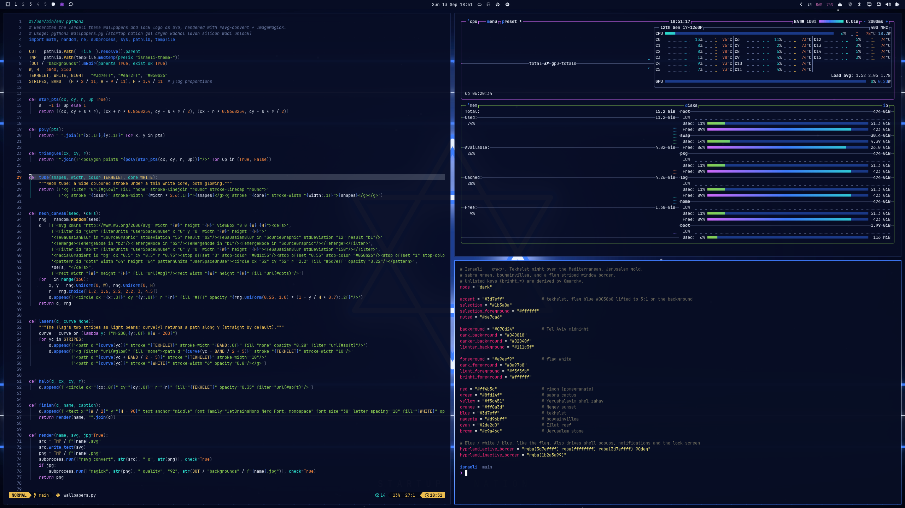

# Omarchy Israeli Theme

**ישראלי.** An Israeli theme for [Omarchy](https://omarchy.org): the flag
drawn in blue neon on a midnight background, window borders striped
blue-white-blue like the flag with a glow on the focused window, and terminal
colors taken from Jerusalem stone, sabra cactus, pomegranates, bougainvillea
and the Eilat reef.



## Install

```bash
omarchy theme install https://github.com/GruperTal/omarchy-israeli-theme
```

## Wallpapers

- [Startup Nation](backgrounds/1-startup-nation.jpg): the flag's stripes as light beams around a neon Star of David
- [Gal](backgrounds/2-gal.jpg): the same flag, waving
- [Aryeh Yehuda](backgrounds/3-aryeh-yehuda.jpg): the Lion of Judah as a neon sign
- [Kachol Lavan](backgrounds/4-kachol-lavan.jpg): a wall of neon flags, a few of them flickering out
- [Silicon Wadi](backgrounds/5-silicon-wadi.jpg): the star wired into a circuit board

The wallpapers and the lock screen logo are drawn in code. Run
`python3 wallpapers.py` to render them again (it needs `rsvg-convert`,
ImageMagick and the Noto Hebrew fonts).

The heraldic lion ([`lion.svg`](lion.svg)) is
[Lion rampant element](https://commons.wikimedia.org/wiki/File:Lion_rampant_element.svg)
by Inductiveload, after Jiří Louda, from Wikimedia Commons. It is in the public domain.

## Palette

| Role | Hex | |
| --- | --- | --- |
| Background | `#070d24` | Tel Aviv midnight |
| Foreground | `#e9eef9` | flag white |
| Accent / blue | `#3d7eff` | tekhelet |
| Red | `#ff4b5c` | rimon (pomegranate) |
| Green | `#8fd14f` | sabra cactus |
| Yellow | `#f5c451` | Jerusalem gold |
| Orange | `#ff8a3d` | Negev sunset |
| Magenta | `#d96bff` | bougainvillea |
| Cyan | `#2de2d0` | Eilat reef |
| Brown | `#c9a46c` | Jerusalem stone |

The full palette is in [`colors.toml`](colors.toml). Icons are `Yaru-blue`.
